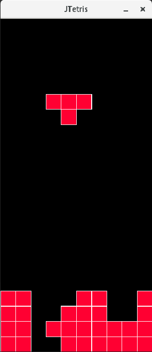

# JTetris: Java Tetris Game
This repo contains implementation of a simple Tetris game with java language. 
Tetris is a tile-matching puzzle game originally designed and programmed by 
Alexey Pajitnov in the Soviet Union.
The intention for this implementation is for educational purposes like design 
and implement a object oriented case study or deriving tests for an OOP program. 
Also design of classed are based on formal requirements and specification 
(you can find the whole case study in G Smith thesis titled Object-Z Specification language), 
therefor it can be used for deriving specification based tests.

## Tetris Specification
 The game is played by a single player on a computer screen. A typical snapshot is shown in the following figure.
 The goal of the player of Tetris is to position falling blocks of various shapes so
 that entire rows of the playing screen are filled. When a row is filled, it disappears
 from the screen, the rows above it move down and the player’s score is advanced.
 The game continues until the fallen blocks pile up to the top of the playing screen.
  
 The blocks fall, one at a time, until they reach either the bottom of the play-
 ing screen or another block which has previously fallen. The player positions the
 falling blocks by moving them left and right and by rotating them.
  
  
    ### Classes Hierarchy
 In this section some important part of the specification of the Tetris game presented. 
 The specification of the game comprises 11 classes 
 which are shown as a class hierarchy in following picture. 
 In addition, a class with the name of Tetris uses this class hierarchy to specify the process of the Tetris game.
   
   
   ### Class Grid
   The Gird class is an abstract class which models two-dimensional grid which can show any form of two-dimensional screen.
   It is used in the specification to define both the playing screen and the various types of blocks of the game.
    It has a state variable named `occuped`. This variable shows filled points on the grid. 
    The class is formally specified in the left side of following picture. 
    As an example, 
    a grid object with `width = 4`, `height = 6`
    and `occupied = { ( 0,0 ), ( 1,2 ), ( 2,2 ), ( 2,3 )` is given in the right side of the following picture.
 
   
   ### Class Screen
   Class `Screen` specifies the screen where the game is drawn. 
   It inherits `Grid` and determines the value of constants length and width to 10 and 22, respectively. 
   Class `Screen` has two operations: `AddBlock` which adds a block to the screen and  `RemoveBlock` which removes a fully occupied row of the screen.
   
   ### Class Block
   The key class in the Tetris specification is `Block`. This class indicates various blocks of the game.  
   `Block` inherits `Grid` and determines that the width and the height of the grid are equal, and also, there are four occupied positions. 
   Also two state variables are added as `x_position` and `y_position` denoting
    the block’s position on the playing screen as shown in the following image.
   This class defines operations `MoveRight`, `MoveLeft` and `MoveDown`, respectively, to move the block to the right, left and down on the screen. 
   Operation `Rotate` is responsible for rotating the block on the screen. It is only specified as abstract in `Block, and descendant classes are responsible for its precise definition.
    
      
  ### All types of the Tetris blocks
  All block of the game are shown in the following picture. 
  Class `Squre` represents the square shape. 
  It inherits `Block` and assigns the width, and the height of the grid with 2. 
  Since rotating (90 degree rotation) a square block has no effect on the occupied positions, operation does not need to be redefined.
  The next five types of blocks are specified with general class `Polygon`. The center of the following picture shows these five blocks. 
  Each polygon block can be represented by a grid whose width and height are 3. 
  To specify the individual blocks, five classes are defined as subclasses of `Polygon` class
  which have a particular initial configuration of occupied positions (classes `T`, `S`, `L`, `Z` and `ReverseL`). 
  The final block type to be specified is rectangle. Right side of the following picture shows this shape. 
  Class `Rectangle` inherits `Block` and assigns the width (and the height) of the grid with 4.
      
        
        
  ## Build and Run
  The project has no dependeny and can be compiled and run on Java 6+.
  Compile the project and run the main method in `GameLuncher` class.
  The snapshot of the running program is in the below.
        
          
  